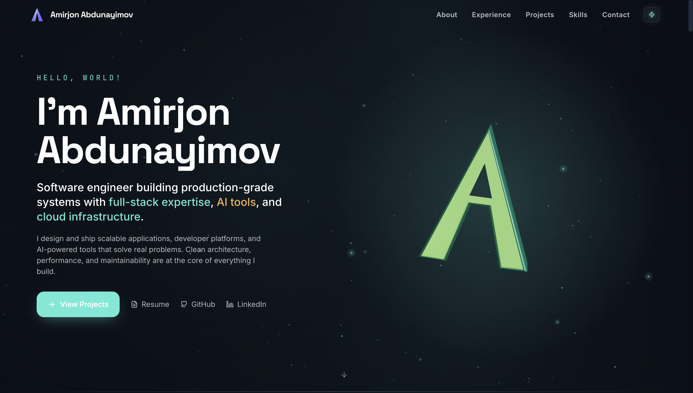
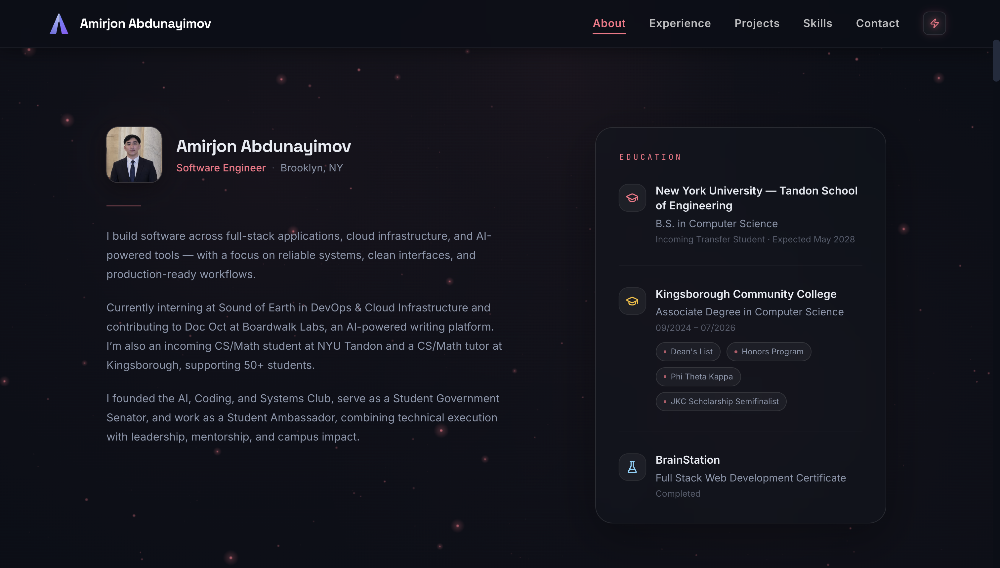
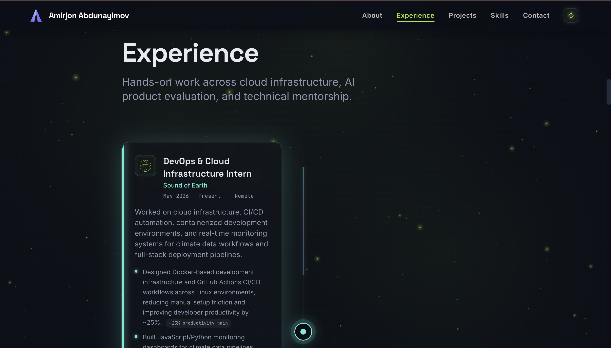
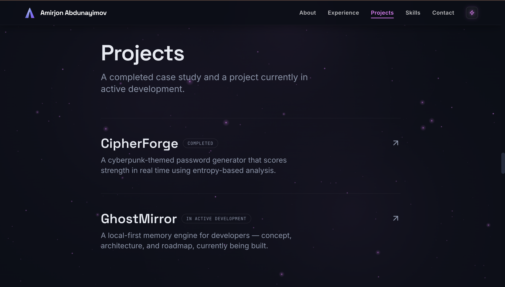

# Amirjon Abdunayimov — Software Engineering Portfolio

A production-ready software engineering portfolio showcasing cloud infrastructure, AI-powered applications, full-stack development, and interactive web experiences.

Built with **Next.js 15**, **React**, **TypeScript**, and **Tailwind CSS**.

**🌐 Live Website:** https://amirjonabd.com

---

# Preview









---

# Overview

This repository contains the source code for my personal software engineering portfolio.

The application highlights my experience in software engineering, cloud infrastructure, DevOps, AI systems, and technical leadership through a modern, production-ready web application built with the latest React ecosystem.

---

# Features

* Next.js 15 App Router architecture
* React Server Components
* TypeScript throughout
* Tailwind CSS design system
* Interactive Three.js hero section
* Framer Motion animations
* Fully responsive mobile-first UI
* Dynamic project showcase
* Professional experience timeline
* Contact form powered by Resend
* SEO optimized
* Accessibility improvements
* Optimized performance
* Analytics integration

---

# Tech Stack

## Frontend

* Next.js 15
* React 19
* TypeScript
* Tailwind CSS

## UI & Animation

* Framer Motion
* React Three Fiber
* Three.js
* Lucide React

## Backend

* Next.js API Routes
* Resend Email API

## Deployment

* Vercel
* Custom Domain (amirjonabd.com)

---

# Project Structure

```text
src/
│
├── app/
├── components/
├── data/
├── hooks/
├── lib/
├── styles/
└── types/

public/
```

---

# Application Sections

* Hero
* About
* Experience
* Projects
* Skills
* Contact

Each section is implemented as an independent React component with reusable animations, shared styling, and modular architecture.

---

# Highlights

## Interactive Hero

* Animated landing experience
* Interactive branding
* Responsive call-to-actions
* Dynamic background effects

## Professional Experience

* Engineering timeline
* Quantified technical achievements
* Leadership experience
* Internship highlights

## Projects

* Production-ready software projects
* Live demonstrations
* GitHub repositories
* Modern technology stacks

## Skills

* Programming Languages
* Frameworks
* Cloud & DevOps
* Artificial Intelligence
* Software Engineering

## Contact

* Production email integration
* Direct social links
* Responsive contact experience

---

# Performance

* Responsive across desktop, tablet, and mobile
* Server-side rendering
* Image optimization
* Lazy loading
* Lighthouse optimized
* Production deployment on Vercel

---

# Local Development

Clone the repository

```bash
git clone https://github.com/Amirjon06/portfolio.git
```

Enter the project

```bash
cd portfolio
```

Install dependencies

```bash
npm install
```

Run the development server

```bash
npm run dev
```

Open your browser:

```text
http://localhost:3000
```

---

# Deployment

The application is deployed on **Vercel** using a custom domain.

**Production:** https://amirjonabd.com

---

# Roadmap

* Technical blog
* Project case studies
* Interactive project demos
* CMS integration
* Visitor analytics dashboard

---

# Contact

**Website:** https://amirjonabd.com

**LinkedIn:** https://linkedin.com/in/amirjon-abd

**GitHub:** https://github.com/Amirjon06

**Email:** [amirjonabd5@gmail.com](mailto:amirjonabd5@gmail.com)

---

## License

This project is licensed under the MIT License.

---

Built with ❤️ by **Amirjon Abdunayimov**
